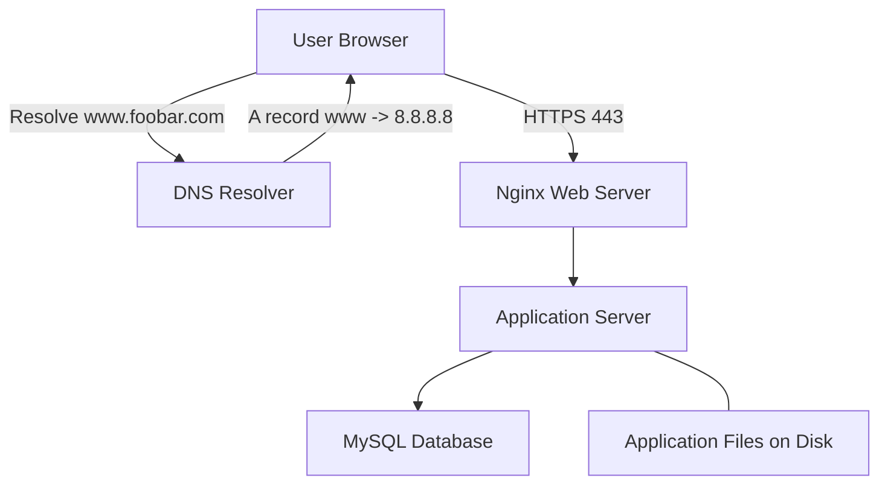

# 0. Simple web stack

## Explanation
- **Server**: a machine (physical or virtual) running OS and services.
- **Domain name role**: human-readable name; DNS maps `www.foobar.com` to the server IP.
- **Type of `www`**: **A record** (IPv4 address) pointing to **8.8.8.8** (placeholder server IP).
- **Web server (Nginx)**: terminates HTTP(S), serves static content, reverse-proxies dynamic requests.
- **Application server**: runs business logic and returns dynamic responses.
- **Database (MySQL)**: stores and queries persistent data.
- **Communication with user**: Browser ↔ server over **HTTPS** (TLS on **TCP 443**).

## Issues
- **SPOF**: one server; if it fails, everything is down.
- **Maintenance downtime**: restarting services to deploy new code causes outages.
- **No scale**: cannot handle big traffic spikes horizontally.
