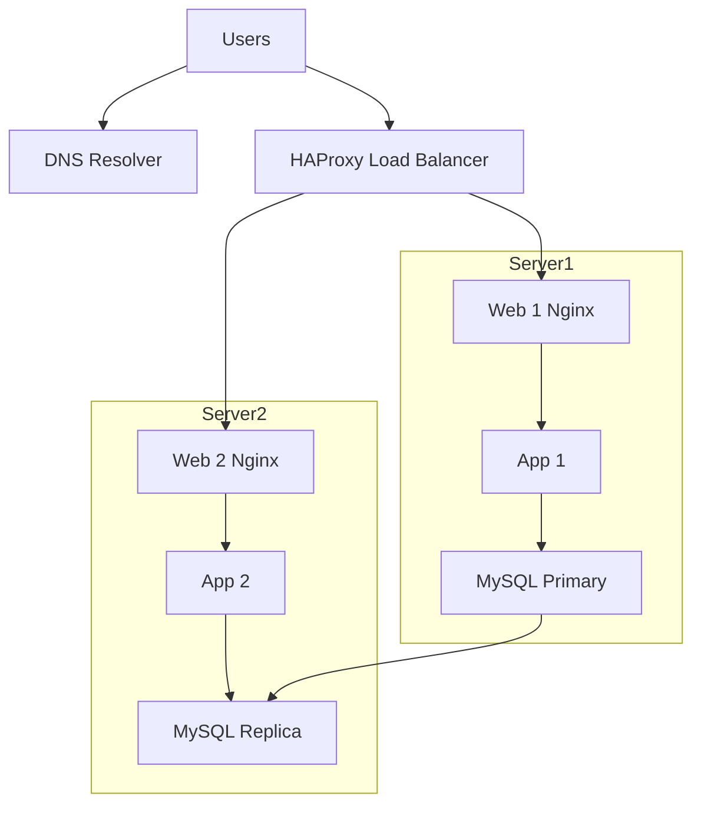

# 1. Distributed web infrastructure

## Why each addition
- **HAProxy**: spreads traffic across backends → higher availability and capacity.
- **Second server**: removes single web/app SPOF; enables horizontal scaling.
- **Primary-Replica DB**: scale reads on the replica and prepare for failover.

## Load-balancing algorithm
- Example **Round-robin** (even distribution) or **Least-connections** (to the least busy backend).

## Active-Active vs Active-Passive
- **Active-Active**: both backends receive traffic simultaneously.
- **Active-Passive**: one backend is on standby, activated on failure.

## Primary-Replica for MySQL
- **Primary**: accepts **writes** and reads.
- **Replica**: receives changes from primary (async or sync) and serves **reads**.

## App perspective
- **Writes → Primary**, **Reads → Replica** when possible.

## Issues that remain
- **SPOF**: load balancer and DNS are still single points.
- **Security**: no firewall, no HTTPS yet.
- **No monitoring**: metrics/logs/alerts missing.
