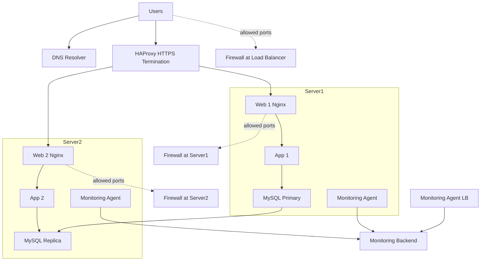

# 2. Secured and monitored web infrastructure

## Why each addition
- **3 firewalls**: enforce least-privilege networking (only required ports).
- **1 SSL certificate**: serve **HTTPS** for privacy, integrity, and server auth.
- **3 monitoring clients**: ship metrics/logs/traces to a backend (Sumologic/ELK/Prometheus).

## What firewalls are for
- Control inbound/outbound access: e.g. **443** to LB from Internet; **80/8080** app only inside; **3306** DB only from app; **22** only from admin IP or bastion.

## Why HTTPS
- Prevents eavesdropping/tampering and authenticates the site to users.

## What monitoring is used for
- Track **availability, latency, errors, resource usage**, and **alert** on issues.

## How data is collected
- Agents **tail logs** and **scrape metrics** (exporters or status endpoints) and send to the monitoring backend.

## Monitor web server QPS
- Enable **Nginx stub_status** or parse access logs; scrape counters at intervals; compute **QPS** and alert on thresholds.

## Issues to explain
- **SSL at LB only**: backend traffic is plain HTTP; use **end-to-end TLS** if required.
- **Single writable MySQL**: primary remains a **write SPOF**; prepare automated failover or multi-primary.
- **Same components everywhere**: increases blast radius; **separate roles** improves isolation.

