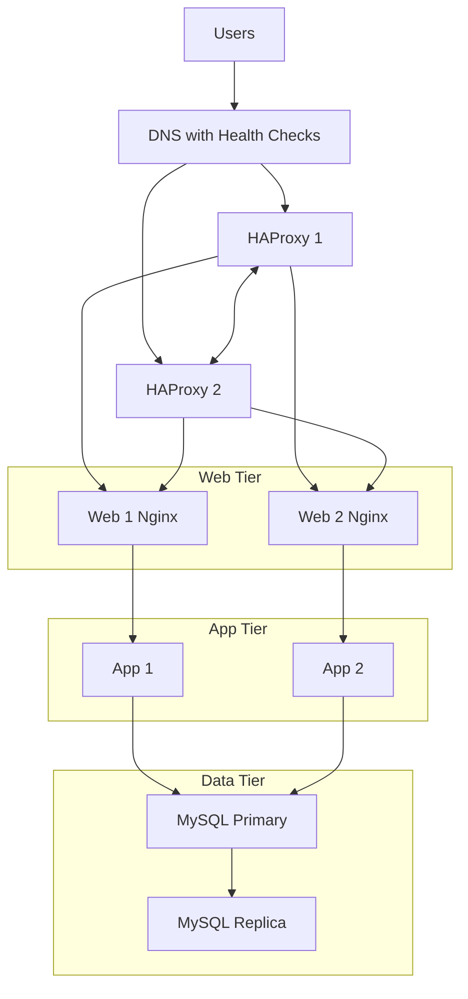

# 3. Scale up

## Why each addition
- **One new server**: extra capacity for split tiers (web, app, data).
- **Second HAProxy in cluster**: removes LB SPOF; active-active or VIP failover.
- **Split components**: isolate **Web**, **App**, **DB** on their own servers for targeted scaling and security boundaries.

